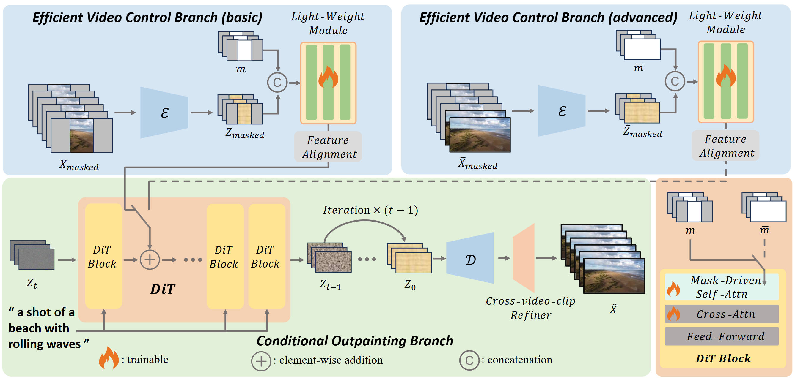

## 📣 Notifications
*We regret to inform you that due to the company's open-source policy, the official release date for OutDreamer is yet to be determined. However, you can refer to **[OutDreamer reproducted by Linhao Zhong](https://github.com/zhongzero/OutDreamer-unofficial)**. We provide guidance throughout the reproduction process. We apologize for any inconvenience this may cause to those interested in our work.*

# OutDreamer: Video Outpainting with a Diffusion Transformer (IEEE Transactions on Image Processing)

 <a href='https://arxiv.org/abs/2506.22298'></a> <a href='https://zhongzero.github.io/OutDreamer/'></a> <a href='https://github.com/zhongzero/OutDreamer'></a> 

https://github.com/user-attachments/assets/efa8130d-f8b9-4857-a375-da1cf0174c5d



We propose OutDreamer, a DiT-based framework with efficient condition injection for video outpainting. Our method can generate high-quality video frames, preserving temporal and color consistency, and use iterative method for long video outpainting.

&nbsp;&nbsp;&nbsp;

## 📎 Citation

Please cite our work if you think it is useful for your research.

```
@article{zhong2026outdreamer,
  title={Outdreamer: Video outpainting with a diffusion transformer},
  author={Zhong, Linhao and Li, Fan and Huang, Yi and Liu, Jianzhuang and Pei, Renjing and Song, Fenglong},
  journal={IEEE Transactions on Image Processing},
  year={2026},
  publisher={IEEE}
}
```
